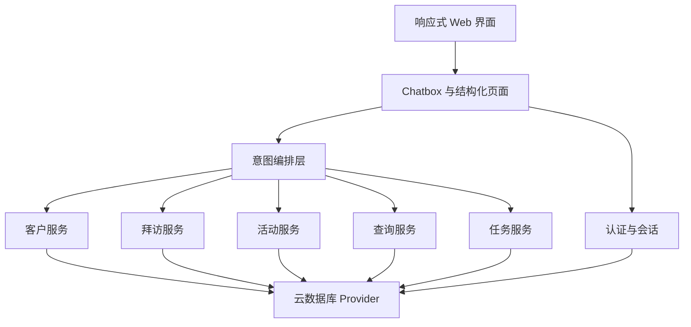

## User Requirements

- 构建一个面向资深保险代理人的 Web 智能体，支持电脑和手机浏览器访问，并可自适应不同屏幕。
- 应用以 chatbox 为主交互入口，代理人通过自然语言输入，智能体理解意图后完成客户管理、查询、记录和提醒等操作。
- 需要客户基础信息管理，支持新增、删除、修改。
- 需要拜访客户记录管理，支持新增、删除、修改。
- 需要客户活动记录管理，支持记录代理人组织多名客户参加活动的情况，并支持新增、删除、修改。
- 需要综合查询，包含客户信息查询、客户经营情况查询、共同特点客户查询等。
- 需要从拜访记录和活动记录中识别后续工作，生成任务提醒。
- 需要用户注册和登录，并保证每个代理人只能查看自己录入的客户和记录。
- 需要一个独立的对话助手，贯穿客户管理过程，同时承担对代理人的赞扬、安慰和陪伴式反馈。

## Product Overview

这是一个以会话驱动的客户经营工作台。界面中心是智能对话框，周边配合客户卡片、记录时间线、任务面板和查询结果视图，让代理人既能像聊天一样发指令，也能清晰查看结构化信息。整体视觉应专业、温和、可信，兼顾效率感与陪伴感。

## Core Features

- 用户注册、登录与个人数据隔离
- 客户基础信息增删改
- 拜访记录增删改
- 多客户活动记录增删改
- 综合查询与相似客户筛选
- 后续任务自动提醒
- 贯穿全流程的独立对话助手

## Tech Stack Selection

- 当前工作区为空目录，按全新项目规划。
- 前端与全栈框架：Next.js（App Router） + TypeScript
- 界面层：Tailwind CSS + shadcn/ui
- 表单与校验：React Hook Form + Zod
- 数据请求与缓存：TanStack Query
- 智能体对话层：服务端意图编排 + 流式消息输出
- 云数据库与认证：默认推荐 CloudBase；同时抽象 Provider 接口，便于后续对齐“智能日记助手”的同类云方案
- 测试：Vitest + Playwright

## Implementation Approach

采用“chatbox 主入口 + 结构化确认面板”的混合方案：用户先用自然语言表达需求，系统将其解析为明确的业务意图，再由对应服务执行；新增、删除、批量活动、任务生成等高风险操作必须先展示确认结果，避免误操作。

业务按 auth、chat、customers、visits、activities、queries、tasks 分模块组织；数据库访问统一经过 repository 和 provider 层，既能满足当前云数据库要求，也能在后续明确“智能日记助手”方案后低成本切换。聊天能力不直接写库，而是先完成权限校验、意图解析、字段补全、确认，再调用业务服务。

性能上，列表和查询优先采用索引字段过滤与分页，目标复杂度控制在 O(log n + k)；共同特点客户查询第一版基于结构化字段、标签和统计条件实现，避免一开始引入高成本搜索方案。任务提醒按来源记录幂等生成，避免重复创建。

## Implementation Notes

- 所有数据读写都以服务端会话中的 userId 为准，不信任客户端上传的 ownerId。
- 删除、批量更新、批量活动关联等动作强制二次确认；意图不明确时先追问，不直接执行。
- 聊天记录、客户列表、经营记录均需分页或按时间窗口加载，避免移动端首屏过重。
- 日志仅记录意图类型、执行结果、耗时和匿名标识，不记录敏感客户详情。
- 在云方案最终确认前，将 SDK 初始化、集合名、认证适配集中在 provider 层，降低后续替换影响面。

## Architecture Design

系统采用分层结构：

- 表现层：响应式页面、chatbox、客户列表、记录时间线、任务面板
- 应用层：意图编排、查询聚合、任务生成、权限守卫
- 领域服务层：客户服务、拜访服务、活动服务、任务服务、用户服务
- 数据访问层：云数据库 Provider、Repository、认证适配



## Directory Structure

## Directory Structure Summary

项目从空目录开始创建，采用以业务模块为中心的目录组织，保证聊天入口、客户经营能力、权限控制和云端适配彼此解耦。

```text
c:/Users/郑理/.codebuddy/保险代理人助手/
├── package.json                                  # [NEW] 项目依赖与脚本入口。定义 Next.js、UI、校验、测试等基础依赖。
├── next.config.mjs                               # [NEW] Next.js 配置。处理构建、图片、安全头和运行环境配置。
├── src/
│   ├── app/
│   │   ├── layout.tsx                            # [NEW] 全局布局。挂载主题、查询客户端、全局提示与响应式容器。
│   │   ├── (auth)/
│   │   │   ├── login/page.tsx                    # [NEW] 登录页。负责账号登录、错误提示和移动端适配。
│   │   │   └── register/page.tsx                 # [NEW] 注册页。负责注册、基础校验与注册后跳转。
│   │   ├── (workspace)/
│   │   │   ├── layout.tsx                        # [NEW] 工作台布局。承载顶部导航、底部导航、chatbox 常驻区。
│   │   │   ├── page.tsx                          # [NEW] 首页工作台。展示主对话区、今日任务、最近客户和鼓励安慰入口。
│   │   │   ├── customers/page.tsx                # [NEW] 客户中心。展示客户列表、详情卡片、经营摘要和对话辅助操作。
│   │   │   ├── records/page.tsx                  # [NEW] 记录中心。管理拜访记录与活动记录，并展示时间线。
│   │   │   └── tasks/page.tsx                    # [NEW] 查询与提醒页。展示综合查询结果、相似客户和任务提醒。
│   │   └── api/
│   │       ├── chat/route.ts                     # [NEW] 对话接口。接收消息、解析意图、返回回复与执行结果。
│   │       ├── customers/route.ts                # [NEW] 客户接口。处理客户增删改查与服务端校验。
│   │       ├── visits/route.ts                   # [NEW] 拜访接口。处理拜访记录增删改查与任务提取。
│   │       ├── activities/route.ts               # [NEW] 活动接口。处理多客户活动记录及参与关系保存。
│   │       └── tasks/route.ts                    # [NEW] 任务接口。处理提醒列表、状态更新与回溯来源。
│   ├── components/
│   │   ├── chat/chat-panel.tsx                   # [NEW] 主 chatbox 组件。支持消息流、快捷意图和确认卡片。
│   │   ├── customers/customer-list.tsx           # [NEW] 客户列表组件。支持筛选、分页和选中态。
│   │   ├── records/record-timeline.tsx           # [NEW] 经营记录时间线。统一展示拜访与活动记录。
│   │   └── tasks/task-board.tsx                  # [NEW] 任务面板组件。展示待办、完成、逾期等状态。
│   ├── modules/
│   │   ├── auth/auth-service.ts                  # [NEW] 认证服务。封装注册、登录、登出、会话读取与权限判断。
│   │   ├── chat/intent-service.ts                # [NEW] 意图服务。将用户输入解析为结构化动作与回复策略。
│   │   ├── chat/action-executor.ts               # [NEW] 动作执行器。根据意图路由到客户、记录、查询、任务服务。
│   │   ├── customers/customer-service.ts         # [NEW] 客户服务。封装客户 CRUD、详情汇总与关联校验。
│   │   ├── visits/visit-service.ts               # [NEW] 拜访服务。封装拜访记录 CRUD 与后续事项提取。
│   │   ├── activities/activity-service.ts        # [NEW] 活动服务。封装活动记录 CRUD 与多客户参与关系维护。
│   │   ├── queries/query-service.ts              # [NEW] 综合查询服务。处理客户查询、经营情况和共同特点筛选。
│   │   └── tasks/task-service.ts                 # [NEW] 任务服务。负责提醒生成、状态流转、幂等去重。
│   ├── lib/
│   │   ├── cloud/provider.ts                     # [NEW] 云服务抽象接口。统一认证、数据库访问和集合操作。
│   │   ├── cloud/cloudbase-adapter.ts            # [NEW] CloudBase 适配实现。作为默认云数据库与认证接入层。
│   │   ├── auth/session.ts                       # [NEW] 会话工具。统一服务端读取登录态和用户标识。
│   │   └── validation/                           # [NEW] 共享校验规则目录。集中管理客户、记录、任务输入校验。
│   ├── types/
│   │   ├── customer.ts                           # [NEW] 客户实体类型。集中定义客户字段与查询入参。
│   │   ├── visit.ts                              # [NEW] 拜访记录类型。集中定义记录字段与状态。
│   │   ├── activity.ts                           # [NEW] 活动记录类型。集中定义活动与参与客户关系。
│   │   ├── task.ts                               # [NEW] 任务实体类型。集中定义提醒、来源、状态。
│   │   └── chat.ts                               # [NEW] 聊天消息与意图类型。定义回复、确认和执行结果结构。
│   └── middleware.ts                             # [NEW] 路由守卫。拦截未登录访问并保护敏感页面。
└── tests/
    ├── modules/query-service.test.ts             # [NEW] 查询服务测试。覆盖综合查询与相似客户筛选逻辑。
    ├── modules/task-service.test.ts              # [NEW] 任务服务测试。覆盖提醒幂等、状态更新和来源回溯。
    └── app/chat-flow.spec.ts                     # [NEW] 关键流程测试。覆盖 chatbox 发起操作到结果回显的链路。
```

## Key Code Structures

- 聊天意图对象：统一描述动作类型、目标对象、补全字段、置信度、是否需要确认和用户可见回复。
- 任务来源对象：统一绑定任务与拜访或活动记录的来源关系，保证提醒可追溯且不会重复生成。
- 查询入参模型：统一封装客户条件、经营条件、标签条件、时间范围和分页信息，避免接口分裂。

## Design Style

采用“高端业务工作台 + 温和陪伴助手”风格。整体以通透层次、柔和高光、稳重蓝绿主色为核心，既体现保险行业的专业可信，也让赞扬与安慰对话显得亲和、稳定。桌面端以双栏或三栏布局突出 chatbox 中心；移动端改为纵向流与底部抽屉，保证单手操作。

## Layout and Interaction

- chatbox 是视觉中心，常驻页面主区域。
- 结构化结果以卡片、时间线、抽屉和确认弹层展示。
- 顶部导航负责品牌、搜索、账号；底部导航负责首页、客户、记录、任务切换。
- 关键按钮采用清晰主次层级，删除和批量操作使用高对比警示态。
- 对话回复加入轻微流式动画，查询结果卡片加入悬浮反馈，整体动态克制但不呆板。

## Page Planning

### 1. 登录注册页

- 顶部品牌区：简洁展示产品名、副标题和可信形象背景。
- 主表单卡片：登录或注册表单集中呈现，强调安全与私密。
- 价值摘要区：用三张小卡片说明客户管理、提醒、陪伴式助手。
- 帮助入口区：提供找回密码、联系支持和隐私说明。

### 2. 工作台首页

- 顶部导航：品牌、全局搜索、账号菜单，桌面端横向展开。
- 主 chatbox：大面积输入区与消息流，承载全部自然语言操作。
- 快捷动作条：用胶囊按钮展示常用意图，如新增客户、记录拜访。
- 今日任务卡：展示待办、逾期、已完成摘要，可一键跳转。
- 最近客户区：显示最近经营客户及最新动态，辅助继续跟进。
- 底部导航：移动端固定展示首页、客户、记录、任务。

### 3. 客户中心

- 顶部导航：保留全局搜索和当前筛选状态。
- 对话辅助条：让用户直接说“帮我找高净值意向客户”等指令。
- 筛选与标签栏：支持按状态、标签、时间、来源快速过滤。
- 客户列表区：卡片式列表展示姓名、分层、最近跟进和提醒状态。
- 客户详情区：展示基础信息、经营摘要、最近记录和任务入口。
- 底部导航：保持跨页面一致切换体验。

### 4. 记录中心

- 顶部导航：显示拜访记录与活动记录切换入口。
- 记录对话区：支持直接输入“今天拜访了张三，约下周跟进”。
- 时间线列表：按时间展示拜访和活动记录，强调最近动态。
- 参与客户卡：活动记录中突出多客户关联关系与人数信息。
- 后续任务预览：在保存前展示自动识别出的待办事项。
- 底部导航：保证移动端可快速回到任务和客户页。

### 5. 查询与提醒页

- 顶部导航：显示查询模式与保存筛选入口。
- 智能查询框：支持自然语言查询客户信息、经营情况、共同特点。
- 条件标签区：把系统理解出的条件转为可编辑标签。
- 结果聚类区：用卡片组展示客户分组、共同特点和经营洞察。
- 任务看板区：按待办、已完成、逾期展示提醒，支持快捷更新。
- 底部导航：统一承载移动端主导航。

## Responsiveness

桌面端优先展示 chatbox 与结果并排；平板端折叠为双栏；手机端采用单列流式布局，详情和确认界面使用底部抽屉，确保信息不拥挤、输入区始终可见。

## Agent Extensions

### Skill

- **skill-creator**
- Purpose: 沉淀 chatbox 智能体的角色说明、意图清单、执行边界、确认策略和赞扬安慰回复规范
- Expected outcome: 形成可直接落地的智能体能力规范，支撑客户管理与情绪陪伴一体化对话

### SubAgent

- **code-explorer**
- Purpose: 在实现阶段持续扫描新增页面、接口、服务和类型文件，核对跨模块依赖与影响范围
- Expected outcome: 减少漏改和权限链路遗漏，保证聊天、查询、提醒、数据隔离实现一致